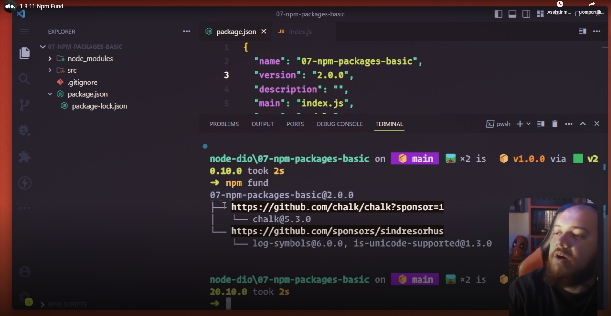
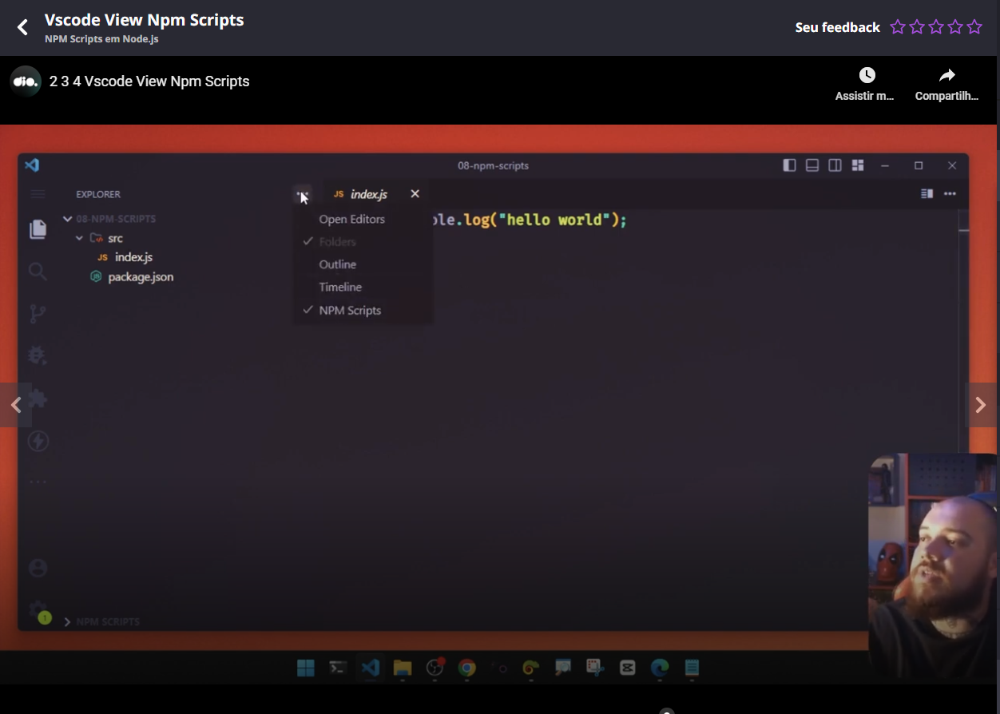

# Random comments

You can use [PNPM](https://pnpm.io/pt/) with Node.JS. Teacher talked that the package manager, NPM, Yarn or PNPM does not matter. He talked that he uses NPM.

To install a dev dependency, please use the **-D** flag. Example:

```sh
npm install -D <package-name}
```


## npm fund

With this command you can see the place where a package was downloaded:




## Running scripts in VSCode

In the Explorer box you can click in the three dots and enable the 'NPM scripts' box:



You can also run a script through package.json


## Slides of the class

[link](https://hermes.dio.me/files/assets/a684aca0-7cf3-4a7b-9c29-f68d085f4009.pptx)


## Link to useful packages

[Link](https://firebearstudio.com/blog/node-js-command-line-apps-utilities.html)

